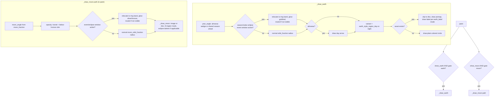

# Year Marker Layer — Flow

**About:** [description](../__about/year_marker.md)

## Algorithm

Pseudocode (language-neutral):

    IF show_earth AND gate("earth"): _draw_earth()
    IF show_moon AND gate("moon"):
        moon_angle = moon_cycle_angle(tick.moon_fraction)
        opacity = moon_transit_opacity(...) IF show_earth ELSE 1.0
        IF NOT tick.is_moon_up: opacity *= moon_hidden_alpha
        eclipse = tick.eclipse_event IF kind == "lunar" ELSE None
        glowing = tick.moon_event is not None OR eclipse is not None
        orbit = ring-band radius IF glowing ELSE moon_orbit_fraction
        pos = dial_point(moon_angle, radius * orbit)
        IF glowing:
            color, strength = eclipse colors/magnitude, or plain moon-glow
            IF eclipse is real but NOT visible from here: mute to silver
            draw_event_glow(pos, size, color, strength)
        _draw_moon(pos, size, darken_state=eclipse render state)

    FUNCTION _draw_earth():
        year_angle = almanac_marker_angle(date) IF Calendar+almanac wheel
                     ELSE tick.year_angle
        eclipse = tick.eclipse_event IF kind == "solar" ELSE None
        glowing = tick.season_event is not None OR eclipse is not None
        orbit = ring-band radius IF glowing ELSE spec.orbit_fraction
        pos = dial_point(year_angle, radius * orbit)
        IF glowing: draw_event_glow(pos, size, color, strength)  # gold/red
        IF almanac: draw the day arrow at this tick
        variant = f"{earth_style}_{earth_region(latitude, default)}_{day_or_night}"
        asset = eclipse art IF a solar eclipse is active ELSE variant's asset
        IF asset exists:
            clip to the marker disc; draw it; draw the label (one of 4 modes)
        ELSE:
            draw a plain bordered circle in the day/night color

    FUNCTION _draw_moon(pos, size, darken_state):
        draw the moon image or a dark disc
        lit = moon_lit_region(fraction, radius)      # union/difference geometry
        fill the lit region (or subtract it as a shadow over the image)
        IF darken_state is not None:
            multiply the WHOLE disc by a neutral (or copper, for totality)
            gray — a true brightness cut, not a translucent color wash

    FUNCTION earth_region(latitude, default) -> region_name:
        IF latitude at/beyond the pole threshold: RETURN "north_pole"/"south_pole"
        ELSE: RETURN default                          # the active continent
