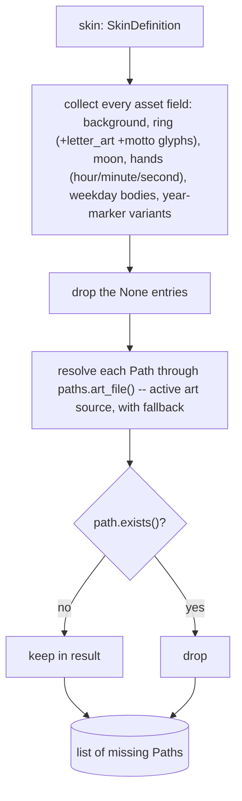

# Manifest — Flow

**About:** [description](../__about/manifest.md)

## Schema — The Config Tree

`SkinDefinition` is not loaded from a file — it is instantiated directly
(`config.defaults.DEFAULT_SKIN`), then copied with overrides
(`dataclasses.replace`) by the controller's `build_skin`. The tree below
is every field, grouped exactly as the class body groups them.

```
SkinDefinition
  z_order: tuple[str, ...]              -- layer names, bottom-up
  background: BackgroundSpec
    base_asset: Path | None             -- None -> procedural 30-section Umbra
    day_alpha, twilight_alpha: float    -- Aura opacity, sunlit / dawn-dusk
    umbra_radius_fraction: float
    aura_radius_fraction: float
  star: StarSpec
    day_alpha, twilight_alpha, border_alpha: float
    border_width_fraction: float
    radius_fraction: float
  ring: RingSpec
    asset: Path | None                  -- None -> procedural ring
    fill, text_color, letter_color: str
    width_fraction: float
    letters: dict[hour -> str]
    letter_art: dict[hour -> Path]      -- always the GOLD master
    letter_metal: dict[hour -> str]     -- active finish, derived at load
    letter_zoom: dict[hour -> float]    -- default 1.0
    letter_legend: dict[hour -> dict]   -- {name, reading}
    motto: tuple[dict, ...]             -- outer arc text, per preset
    motto_metal: str = "gold"
  weekday_set: WeekdaySpec
    bodies: dict[name -> Path | None]
    body_names, body_colors: dict[name -> str]
    display_mode: str                   -- "ghost" | "center_only"
    ghost_opacity, center_scale, diamond_scale, orbit_fraction: float
    metal: str | None = None            -- theme metal swap
    dual_asset: Path | None = None      -- Sunday servant face
    article_set: str | None = None
    body_articles: dict | None = None
    dual_names: tuple | None = None
  year_marker: YearMarkerSpec
    variants: dict[key -> Path]         -- e.g. "europe_day"
    default_variant: str
    day_color, night_color: str
    orbit_fraction, scale: float        -- Earth
    moon_asset: Path | None
    moon_lit_color, moon_dark_color: str
    moon_shadow_alpha: float
    moon_orbit_fraction, moon_scale: float
    moon_hidden_alpha: float = 0.5
  hands: HandsSpec
    hour, minute: HandSpec
      asset: Path
      natural_height, pivot_y: float
      pivot_x_fraction: float | None = None
    minute_reach_fraction, second_reach_fraction: float
    second: HandSpec | None = None
    z_order: tuple[str, ...] = ("hours", "minutes", "seconds")
    desaturate: bool = False

  -- DISPLAY SCALARS (tray/settings overlay onto the pack at build time) --

  POINTER & PALETTE
    pointer: str = "hexa"                    -- hexa/cross/octa/trio/aurora/calendar/rose
    pointer_shape: str = "star"               -- "star" | "polygon"
    polygon_curvature: float = 0.0            -- 0..1
    polygon_edge: str = "smooth"              -- "smooth" | "notched"
    palette_style: str = "primary"            -- primary | secondary | tertiary
    cube_look: bool = False
    daylight: bool = True                     -- Calendar/Rose only
    hide_night_borders: bool = False
    solar_rotation: bool = True
    archetype_mode: bool = False
    archetype_names: bool = True
    pointer_saturation: float = 1.0           -- Aura wedges only
    ring_saturation: float = 1.0              -- ring band art
    calendar_mount: str = "zodiac"            -- "off" | a CALENDAR_MOUNTS key

  UMBRA
    umbra_form: str = "fine"                  -- fine(30) | coarse(24) | gradient
    umbra_contrast: str = "full"              -- full | half

  SLOTS
    octa_slot: str = "time"                   -- OCTA_SLOT_MODES
    day_slot_style: str = "sign"
    info_slot_style: str = "sign"
    info_slot_theme: str = "planets"
    info_slot_metal: str = "bronze"
    info_slot_roster: str = "planetary"
    weekday_slot: str = "weekday"
    third_slot: str = "date"
    third_slot_style: str = "sign"
    third_slot_theme: str = "planets"
    third_slot_metal: str = "bronze"
    third_slot_roster: str = "planetary"
    show_third_slot: bool = False
    show_octa_slot: bool = False

  ELEMENTS SWITCHES
    show_earth: bool = True
    show_moon: bool = True
    show_weekday: bool = True
    show_pointer: bool = True
    colorful: bool = True                     -- False -> Aura plain white
    show_seconds: bool = True
    earth_style: str = "clean"                -- clean | atmo
    earth_label: str = "date"                 -- EARTH_LABEL_MODES
    weekday_theme: str = "planets"             -- WEEKDAY_THEMES
    show_weekday_names: bool = True
    show_info_slot_names: bool = True
    legend: bool = True                       -- False -> no hovers at all

  RING
    ring_tint: str | None = None              -- #RRGGBB or None
    ring_finish: str = "gold"                 -- gold | silver | bronze
    ring_letter_scale: float = 1.0
    subdial_style: str = "black"              -- theme | black

  YEAR LINE
    era_notation: str = "bce_ce"              -- bce_ce | bc_ad
    show_era_suffix: bool = False
    third_era: str = "none"

  DISPLAY CONTEXT & RUNTIME-ONLY
    hover_enlarge: float = 1.2
    palette_override: tuple[str, ...] | None = None   -- never serialized
    display: paths.DisplayContext = paths.DEFAULT_DISPLAY
```

## `missing_assets()` Flow



Pseudocode:

    MISSING_ASSETS(skin):
        referenced = [
            skin.background.base_asset, skin.ring.asset,
            skin.year_marker.moon_asset,
            skin.hands.hour.asset, skin.hands.minute.asset,
            skin.hands.second.asset IF skin.hands.second ELSE None,
            *skin.ring.letter_art.values(),
            *(path for motto in skin.ring.motto for path, _ in motto["glyphs"]),
            *skin.weekday_set.bodies.values(),
            *skin.year_marker.variants.values(),
        ]
        RETURN [p for p in referenced IF p is not None AND NOT ART_FILE(p).exists()]
